<p align="center">
  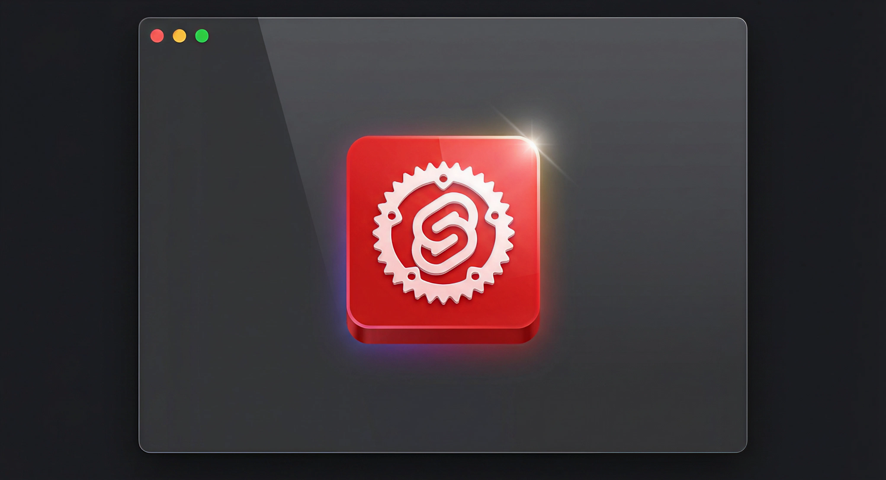
</p>

<h3 align="center">A native desktop engine for Svelte</h3>

<p align="center">
  Svelte is the language. Rust is the kernel. Your app owns every pixel.
</p>

> **Early Development** — RVST is an active research project, not production-ready software. APIs will change. Features are incomplete. If you're building something that needs to ship today, use Tauri or Electron. If you want to explore what native Svelte rendering could look like, read on.

<p align="center">
  <a href="#quick-start">Quick Start</a> |
  <a href="#how-it-works">How It Works</a> |
  <a href="#native-apis">Native APIs</a> |
  <a href="#templates">Templates</a> |
  <a href="#configuration">Configuration</a>
</p>

---

## What is RVST?

RVST is a new execution target for Svelte. Write components with Svelte 5, style with Tailwind or scoped CSS, and ship a native desktop app. No Electron. No webview. RVST replaces the browser engine entirely with a purpose-built Rust rendering stack.

Your Svelte code compiles to JavaScript as usual. RVST executes it in an embedded QuickJS runtime, maps the component tree to a Rust layout engine (Taffy), renders with a GPU vector graphics engine (Vello), and displays in a native window (winit). The result is a desktop app that starts instantly, uses minimal memory, and renders at native quality.

**What you get:**

- Svelte 5 with runes, reactivity, scoped styles, component composition
- Tailwind v4 with full utility class support and design tokens
- CSS custom properties, @media queries, !important, :not(), :nth-child
- Custom window chrome (traffic lights, Windows controls, or your own)
- Native file system access from Svelte components
- GPU-accelerated rendering with Vello
- Icon fonts (Phosphor, Material Symbols, etc.)
- Headless rendering and scene graph queries (RenderQuery)

## Quick Start

### Install

```bash
npm install -g @rvst/cli
```

This installs the `rvst` command globally. It downloads the correct Rust binary for your platform automatically.

### Create a new app

```bash
rvst create my-app
cd my-app
npm install
```

### Write your first component

```svelte
<!-- src/App.svelte -->
<script>
  let count = $state(0);
</script>

<div class="app">
  <h1>Hello from RVST</h1>
  <button onclick={() => count++}>
    Clicked {count} times
  </button>
</div>

<style>
  .app {
    display: flex;
    flex-direction: column;
    align-items: center;
    justify-content: center;
    height: 100%;
    gap: 16px;
    font-family: system-ui;
  }
  button {
    padding: 8px 16px;
    border-radius: 6px;
    background: #3b82f6;
    color: white;
    border: none;
    font-size: 14px;
    cursor: pointer;
  }
</style>
```

### Entry point

```js
// src/entry.js
import { mount } from 'svelte';
import App from './App.svelte';

export function rvst_mount(target) {
  return mount(App, { target });
}
export default rvst_mount;
```

### Vite config

```js
// vite.config.js
import { defineConfig } from 'vite';
import { svelte } from '@sveltejs/vite-plugin-svelte';
import { rvstPlugin } from '@rvst/vite-plugin';

export default defineConfig({
  plugins: [rvstPlugin(), svelte()],
  build: {
    outDir: 'dist',
    target: 'esnext',
    lib: {
      entry: 'src/entry.js',
      formats: ['es'],
      fileName: 'app',
    },
  },
});
```

### Build and run

```bash
rvst build
rvst run
```

Or with watch mode for development:

```bash
rvst dev
```

## How It Works

```
Svelte Component (.svelte)
        |
        v
  Vite + vite-plugin-rvst
  (compiles to JS bundle)
        |
        v
  QuickJS Runtime (executes JS)
        |
        v
  DOM Stubs (translate DOM ops to Rust ops)
        |
        v
  rvst-tree (DOM-like tree in Rust)
        |
        v
  lightningcss (CSS parsing + cascade + var() resolution)
        |
        v
  Taffy (CSS Flexbox/Grid layout)
        |
        v
  Vello + wgpu (GPU vector rendering)
        |
        v
  winit (native window)
```

RVST intercepts Svelte's compiled DOM operations at the lowest level. When Svelte calls `createElement`, `setAttribute`, or `insertBefore`, these become Rust ops that build a tree. CSS is parsed by lightningcss with full cascade, specificity, custom property inheritance, and @media query evaluation. Taffy computes layout. Vello renders to the GPU.

The entire pipeline runs on the main thread with sub-millisecond frame times for typical UIs.

## Native APIs

RVST exposes native platform capabilities to Svelte via `globalThis.__rvst`:

### Window Management

```svelte
<script>
  const rvst = globalThis.__rvst;

  // Custom titlebar (remove OS chrome)
  $effect(() => rvst?.disableDecorations());
</script>

<div onmousedown={() => rvst?.startDragging()}>
  <!-- custom titlebar content -->
  <button onclick={() => rvst?.minimize()}>-</button>
  <button onclick={() => rvst?.maximize()}>+</button>
  <button onclick={() => rvst?.close()}>x</button>
</div>
```

### File System

```svelte
<script>
  const fs = globalThis.__rvst?.fs;

  async function loadConfig() {
    const text = fs.readText('/path/to/config.json');
    return JSON.parse(text);
  }

  function saveConfig(data) {
    fs.writeText('/path/to/config.json', JSON.stringify(data, null, 2));
  }
</script>
```

### Available APIs

| API | Description |
|-----|-------------|
| `__rvst.disableDecorations()` | Remove OS window chrome |
| `__rvst.enableDecorations()` | Restore OS window chrome |
| `__rvst.startDragging()` | Begin window drag (call from mousedown) |
| `__rvst.minimize()` | Minimize window |
| `__rvst.maximize()` | Maximize/restore window |
| `__rvst.close()` | Close window |
| `__rvst.fs.readText(path)` | Read file as string |
| `__rvst.fs.writeText(path, content)` | Write string to file |

## Configuration

### CLI

```
rvst create <name> [-t template]   Scaffold a new project
rvst dev                           Build + watch for changes
rvst build                         Build the Svelte bundle
rvst run [file.js] [file.css]      Run the desktop app
rvst snapshot [file.js]            Dump scene graph as JSON
rvst a11y [file.js]                Dump accessibility tree
rvst ascii [file.js]               Semantic tree dump (default)
rvst --ascii=tree:css [file.js]    Tree with CSS classes + properties
rvst --ascii=structure [file.js]   Box-drawing layout map
rvst --ascii=validate [file.js]    Cross-validate tree vs pixels
rvst --filter="role:button"        Filter tree output
rvst analyze [CATEGORY] [file.js]  Run scene analysis
  diagnostics                        Zero-size, offscreen, overlap, no-handler
  layout                             Depth, utilization, whitespace, flex stats
  a11y                               Unlabeled buttons, missing handlers, roles
  contrast                           WCAG 2.1 AA/AAA contrast ratios
  heatmap                            Node density truecolor heatmap
  all                                Run all analyzers
rvst --version                     Show version
```

### Fonts

Place `.ttf` or `.otf` files in a `fonts/` directory next to your bundle. RVST auto-loads them at startup.

```
dist/
  app.js
  app.css
  fonts/
    Phosphor.ttf        # icon font
    Inter-Variable.ttf   # custom text font
```

Use in CSS:

```css
.icon { font-family: "Phosphor"; font-size: 16px; }
.heading { font-family: "Inter"; font-weight: 600; }
```

### CSS Support

RVST's CSS engine (powered by lightningcss) supports:

- Full cascade with specificity and source order
- `!important` override
- CSS custom properties with ancestor inheritance (`var(--theme-bg)`)
- `@media` queries (min-width, max-width, min-height, max-height)
- `@layer` (Tailwind v4)
- Selectors: class, ID, tag, attribute, `:not()`, `:first-child`, `:last-child`, `:nth-child`
- Pseudo-classes: `:hover`, `:focus`, `:active`
- Combinators: descendant, child (`>`), adjacent (`+`), sibling (`~`)
- `calc()` with rem, em, px, vw, vh, %
- `linear-gradient()` backgrounds
- `transform`: translate, rotate, scale, skew
- `text-decoration`: underline, line-through, overline
- Flexbox and CSS Grid (via Taffy)
- `border-radius`, `box-shadow` (multiple), `opacity`

## Templates

```bash
rvst create my-app                     # default — counter with scoped CSS
rvst create my-app -t tailwind         # Tailwind v4 + utility classes
rvst create my-app -t dashboard        # custom titlebar, routing, dark/light theme, icons
rvst create my-app -t shadcn           # Tailwind + bits-ui component primitives
```

## Architecture

```
packages/rvst/
  crates/
    rvst-core/         Protocol layer (NodeId, Op, Rect)
    rvst-tree/         DOM-like tree with event handlers
    rvst-text/         Text shaping (Parley) + font metrics (skrifa)
    rvst-quickjs/      QuickJS runtime + DOM stubs for Svelte 5
    rvst-shell/        Layout (Taffy) + rendering (Vello) + windowing (winit)
    rvst-render-wgpu/  GPU rendering backend
  js/
    vite-plugin-rvst/  Vite plugin (redirects Svelte internals to RVST bridge)
    renderer-bridge-js/ DOM operation bridge (Svelte → RVST ops)
```

## Platform Support

| Platform | Status | Notes |
|----------|--------|-------|
| macOS (Apple Silicon) | Stable | Primary development platform. Metal backend. |
| macOS (Intel) | Stable | Metal backend. |
| Linux (X11/Wayland) | Supported | Vulkan backend. Install `vulkan-loader` and GPU drivers. |
| Windows 10/11 | Supported | DX12 backend (Vulkan fallback). |
| Headless/CI | Supported | Software rendering via LLVMpipe/SwiftShader. |

### Linux Setup

```bash
# Ubuntu/Debian
sudo apt install build-essential pkg-config libvulkan-dev libwayland-dev

# Fedora
sudo dnf install vulkan-loader-devel wayland-devel
```

### Windows Setup

No additional dependencies. wgpu uses DX12 natively. Ensure GPU drivers are up to date.

## Headless Mode

RVST can render without a window for testing, CI, or server-side rendering:

```bash
# Dump scene graph
rvst --snapshot dist/app.js | jq '.nodes | length'

# Dump accessibility tree
rvst --a11y dist/app.js | jq '.[] | select(.role == "button")'
```

### ASCII Scene Introspection

RVST can visualize UI state as text — useful for AI agents, debugging, and CI validation. All examples below are from the same dashboard app:

<p align="center">
  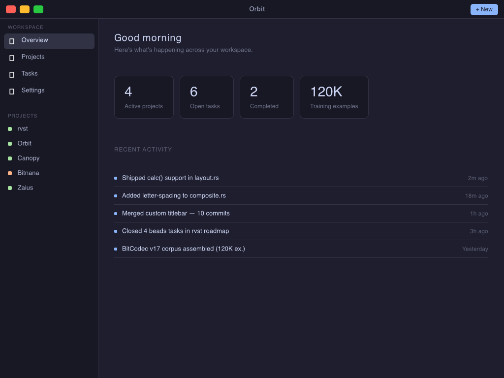
  <br><em>Dashboard app — traffic lights, sidebar nav with icons, stat cards, activity feed</em>
</p>

#### Visualization Modes

**Structure** — box-drawing layout map showing element boundaries and nesting:

```bash
rvst --ascii=structure dist/app.js
```

<p align="center">
  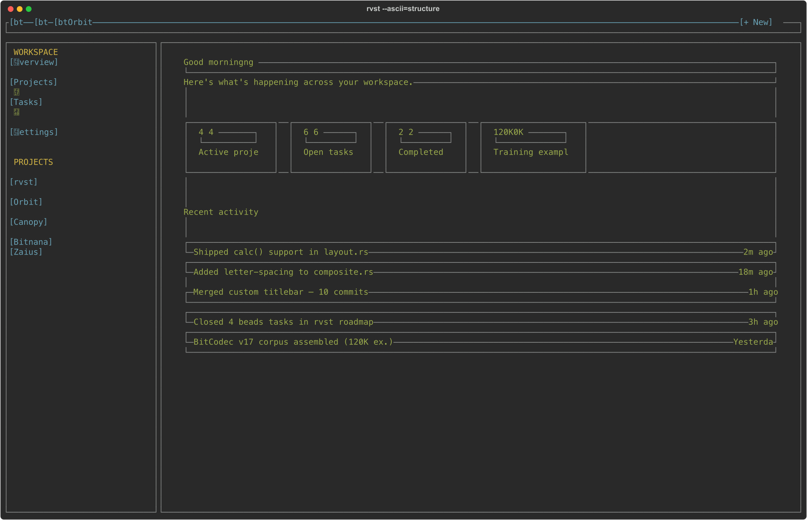
</p>

**Render** — pixel-sampled ASCII art of the actual GPU output:

```bash
rvst --ascii=render dist/app.js
```

<p align="center">
  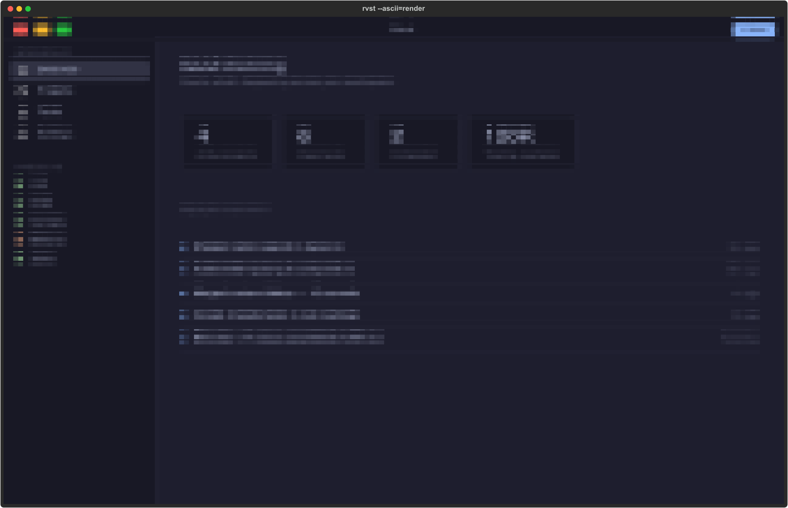
</p>

**Overlay** — pixel background with semantic labels overlaid:

```bash
rvst --ascii=overlay dist/app.js
```

<p align="center">
  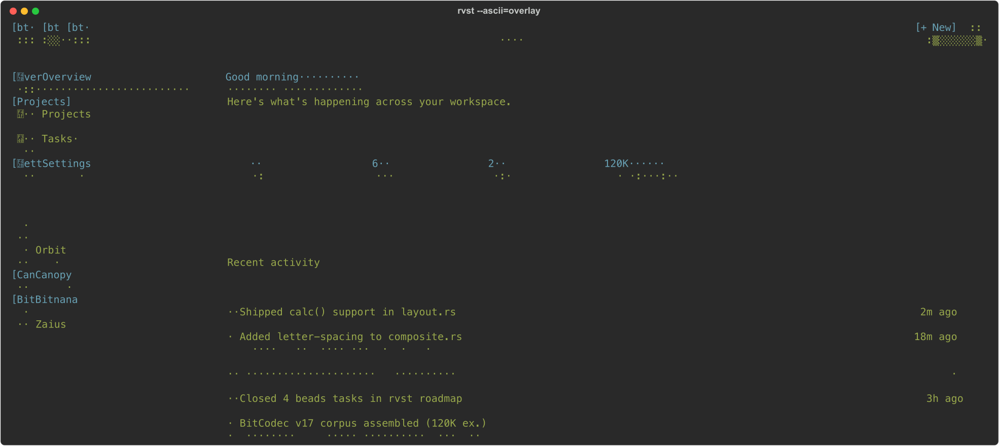
</p>

**Validate** — cross-checks tree against pixels, marks mismatches with `!`:

```bash
rvst --ascii=validate dist/app.js
```

<p align="center">
  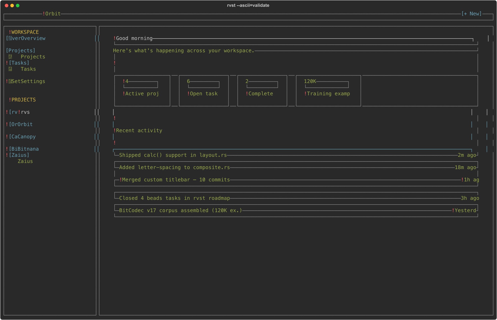
</p>

#### Tree Views

**Semantic tree** (default) — compact, agent-friendly:

```bash
rvst --ascii dist/app.js
```

<p align="center">
  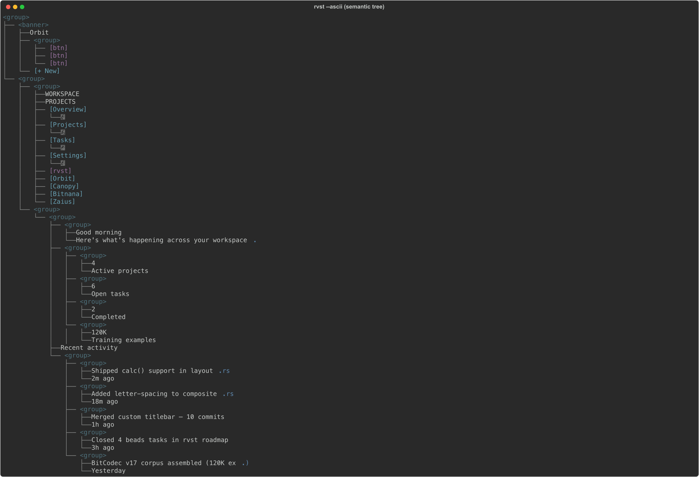
</p>

**Tree with CSS** — classes and key computed properties:

```bash
rvst --ascii=tree:css dist/app.js
```

<p align="center">
  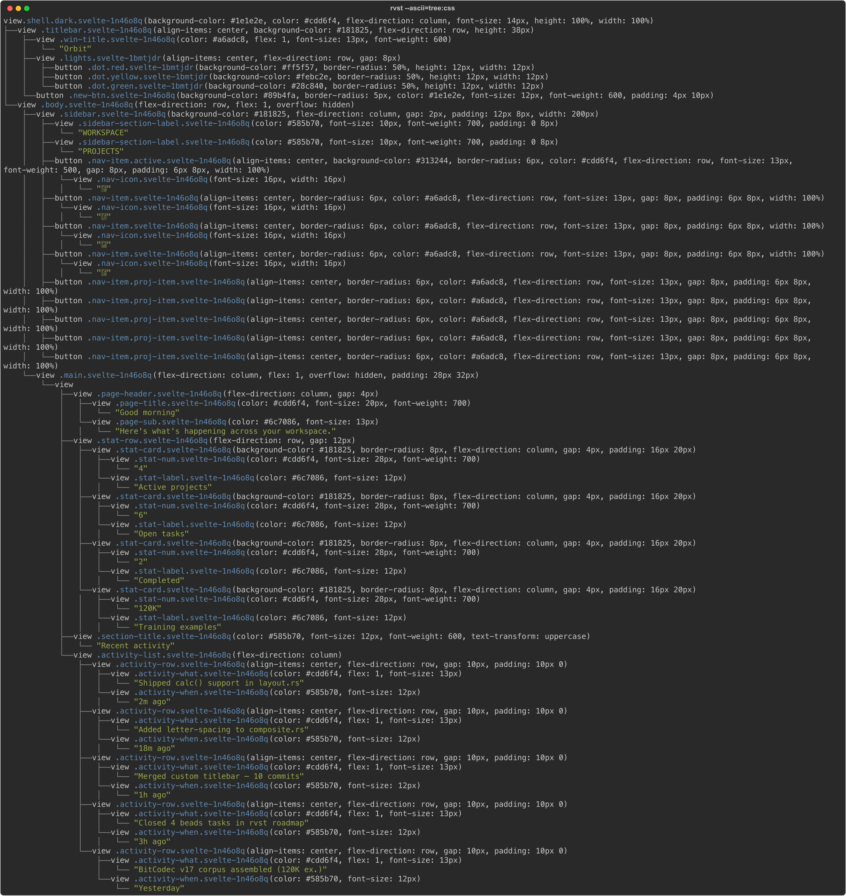
</p>

**Tree with layout** — computed rects (position + size):

```bash
rvst --ascii=tree:layout dist/app.js
```

<p align="center">
  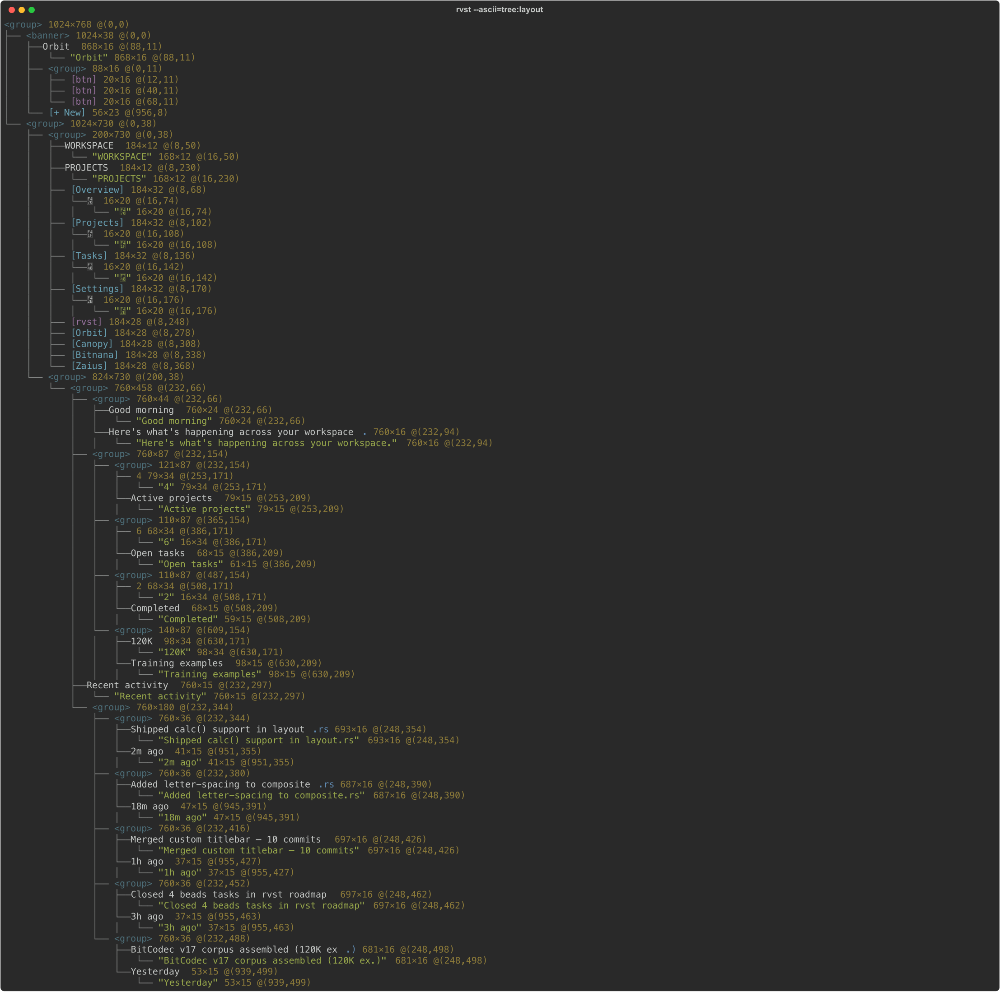
</p>

**Full tree** — role + classes + rects combined:

```bash
rvst --ascii=tree:full dist/app.js
```

<p align="center">
  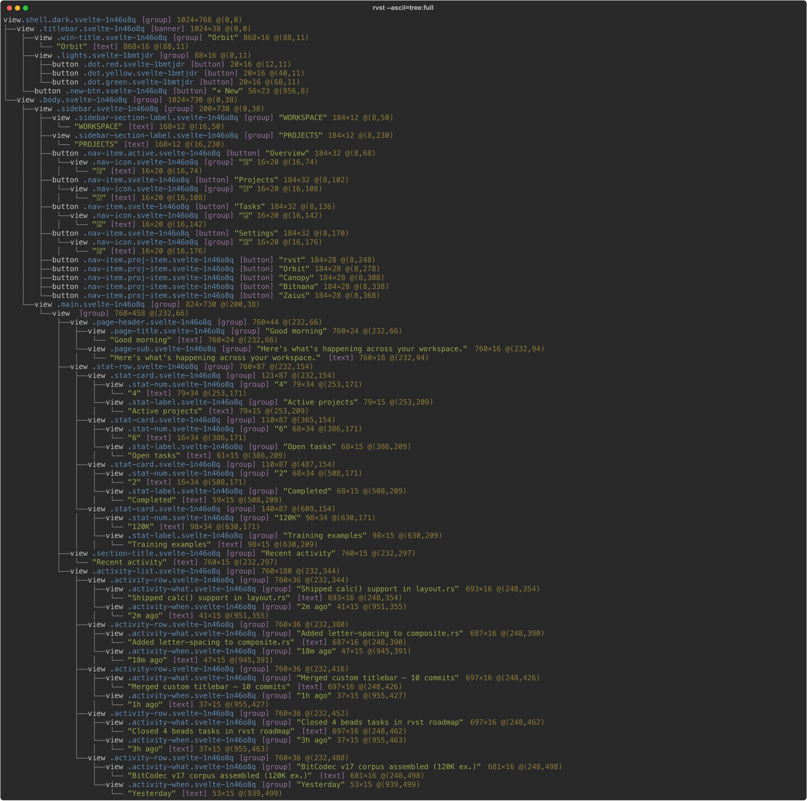
</p>

#### Filtering

Filter the tree to focus on specific elements:

```bash
# Show only buttons
rvst --ascii=tree --filter="role:button" dist/app.js

# Find elements with a CSS class
rvst --ascii=tree:css --filter="class:bg-red" dist/app.js

# Combine filters with +
rvst --ascii=tree --filter="role:button+has:handler" dist/app.js
```

### Scene Analysis

RVST includes built-in analyzers that inspect your UI for layout issues, accessibility gaps, and contrast problems. Each produces a colored terminal report.

#### Diagnostics

Surfaces layout anomalies automatically detected during rendering — zero-size nodes with content, offscreen elements, sibling overlap >50%, and buttons without event handlers:

```bash
rvst analyze diagnostics dist/app.js
```

<p align="center">
  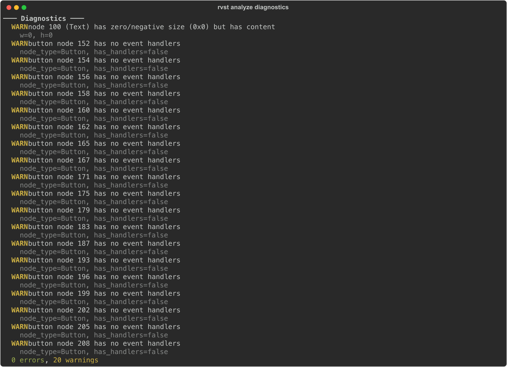
</p>

#### Layout

Quantifies your UI's spatial characteristics — node count, nesting depth, viewport utilization, whitespace ratio, and flex direction distribution:

```bash
rvst analyze layout dist/app.js
```

<p align="center">
  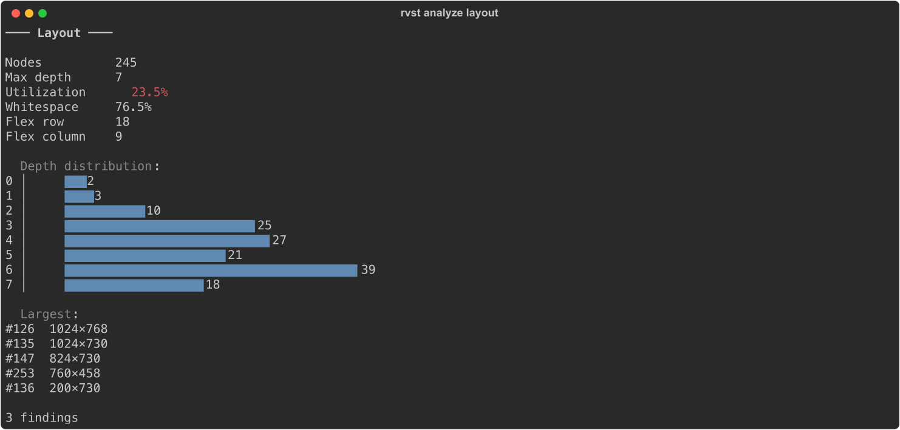
</p>

In this dashboard: 245 nodes, max depth 7, only 23.5% viewport utilization — most content is in the center, leaving the bottom half empty.

#### Accessibility

Audits interactive elements for semantic completeness — buttons without accessible names, interactive elements without handlers, role distribution:

```bash
rvst analyze a11y dist/app.js
```

<p align="center">
  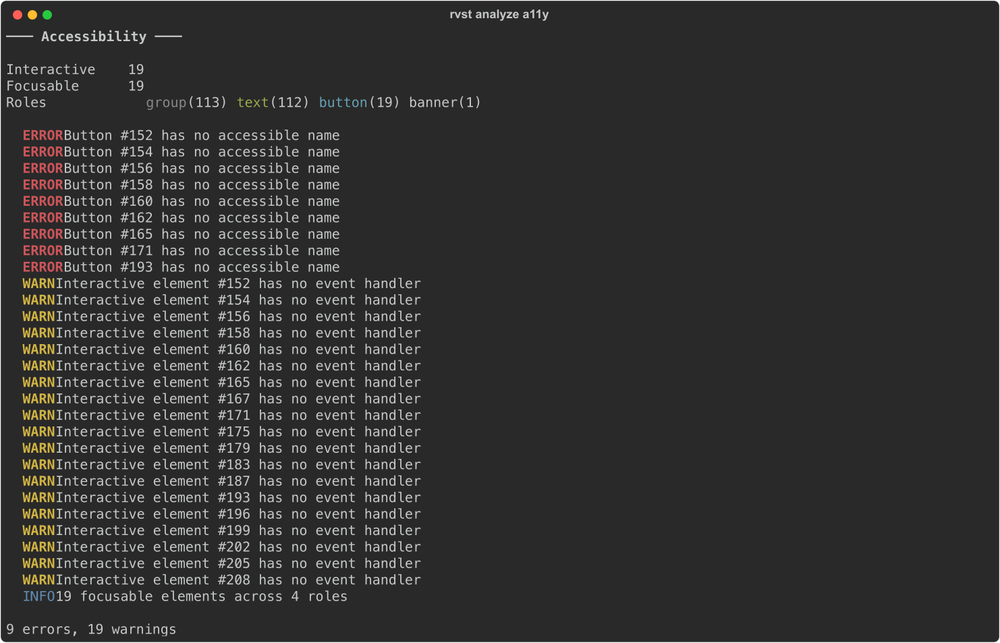
</p>

#### Contrast (WCAG 2.1)

Samples actual rendered pixels behind each text node and computes contrast ratios against WCAG AA (4.5:1) and AAA (7:1) thresholds:

```bash
rvst analyze contrast dist/app.js
```

<p align="center">
  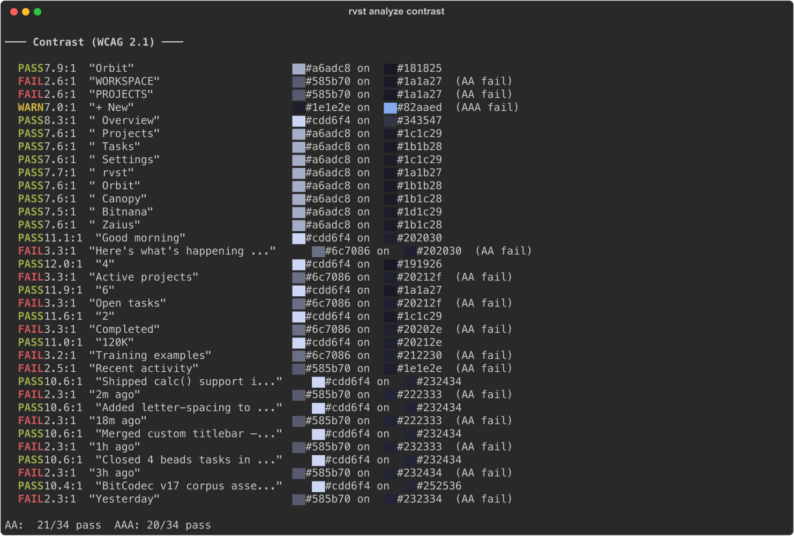
</p>

Shows actual foreground/background colors sampled from the GPU render — not CSS values, but what the user sees.

#### Density Heatmap

Visualizes where UI elements cluster in the viewport as a truecolor terminal heatmap:

```bash
rvst analyze heatmap dist/app.js
```

<p align="center">
  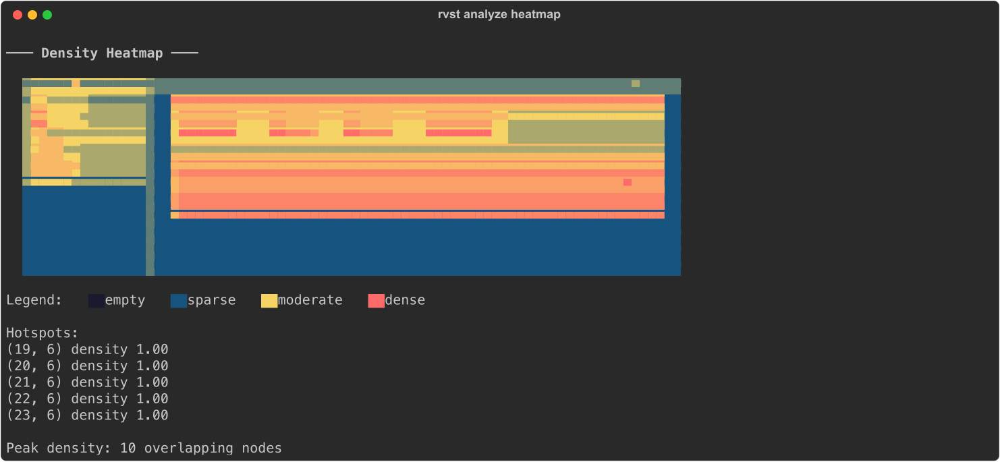
</p>

Cold (blue) = empty space, hot (red) = many overlapping elements. In this dashboard, the sidebar and stat cards are the densest regions.

#### Run Everything

```bash
rvst analyze all dist/app.js
```

### RenderQuery Test Harness

RVST includes a windowed test harness that opens a real GPU-rendered window and accepts JSON commands via stdin. Built for AI agents, CI pipelines, and interactive debugging.

```bash
rvst test launch dist/app.js
```

<p align="center">
  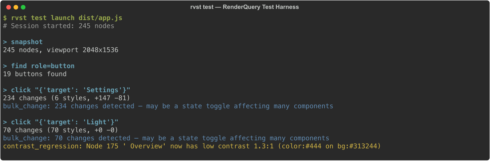
</p>

The app opens in a real window. Send JSON commands on stdin, get JSON responses on stdout — one line per command, one line per response. Every interaction automatically diffs the scene and runs lints.

#### Querying State

```bash
# What's rendered right now?
> {"cmd": "snapshot"}
< {"node_count": 245, "viewport_w": 1024, "viewport_h": 768}

# Find all buttons
> {"cmd": "find", "role": "button"}
< {"count": 19, "nodes": [{"id": 152, "name": "Overview", ...}, ...]}

# Get full diagnostic on one node
> {"cmd": "explain", "id": 134}
< {"layout": {...}, "visibility": {...}, "styles": {...}, "clip_chain": [...]}

# Why can't I see this element?
> {"cmd": "why_not_visible", "id": 500}
< {"visible": false, "reasons": ["ClippedByAncestor(134)"]}
```

#### Interacting with the UI

Every interaction command automatically snapshots before and after, diffs the changes, and runs lints. You get the full picture in one response:

```bash
> {"cmd": "click", "text": "Settings"}
< {
    "ok": true,
    "clicked": "Settings",
    "changes": {"total": 160, "styles": 6, "added": 147, "removed": 7},
    "lints": [
      {"level": "info", "lint": "bulk_change", "message": "160 changes detected"}
    ]
  }
```

Click by text or position. Scroll, type, navigate with tab:

```bash
> {"cmd": "click", "x": 512, "y": 400}
> {"cmd": "scroll", "x": 512, "y": 400, "delta": 200}
> {"cmd": "type", "text": "hello"}
> {"cmd": "navigate", "action": "tab"}
```

#### Automatic Lints

After every interaction, the harness checks for common issues and includes warnings in the response. You don't need to ask — problems surface automatically:

| Lint | Fires when |
|------|-----------|
| `no_effect` | Click produced zero changes |
| `contrast_regression` | Style change reduced text contrast below 3:1 |
| `content_lost` | More nodes removed than added |
| `focus_lost` | Focused element was removed or hidden |
| `empty_content` | New nodes have no text content |
| `buttons_no_handlers` | Buttons without event handlers |
| `scroll_no_effect` | Scroll didn't change position |
| `bulk_change` | >50 changes (info, not warning) |

Example: toggling a theme produces contrast warnings for elements that don't adapt:

```bash
> {"cmd": "click", "text": "Light"}
< {
    "changes": {"total": 70, "styles": 70},
    "lints": [
      {"level": "warning", "lint": "contrast_regression",
       "message": "Node 175 'Overview' now has low contrast 1.3:1 (color:#444 on bg:#313244)"}
    ]
  }
```

#### Diffing State Changes

Mark a snapshot, make changes, then diff:

```bash
> {"cmd": "snapshot_mark", "label": "before"}
> {"cmd": "click", "text": "Add Todo"}
> {"cmd": "diff", "from": "before"}
< {
    "changes": [
      {"NodeAdded": {"id": 500}},
      {"TextChanged": {"id": 92, "before": "3 todos", "after": "4 todos"}},
      {"StyleChanged": {"id": 88, "property": "background", "before": "#313244", "after": "#89b4fa"}}
    ]
  }
```

#### Analysis

Run any of the built-in analyzers on the live rendered app:

```bash
> {"cmd": "analyze", "type": "diagnostics"}
> {"cmd": "analyze", "type": "a11y"}
> {"cmd": "suggest_fixes"}
< {"suggestions": [
    {"severity": "error", "message": "Button #88 has no click handler"},
    {"severity": "warning", "message": "Text contrast 2.6:1 fails WCAG AA"}
  ]}
```

#### Visualization

Get ASCII representations of the live rendered UI:

```bash
> {"cmd": "ascii", "mode": "tree"}
> {"cmd": "ascii", "mode": "structure"}
> {"cmd": "ascii", "mode": "css"}
```

#### Performance

Every response includes timing metadata:

```bash
< {"node_count": 245, "_queue_ms": 2, "_exec_ms": 15}
```

`_queue_ms` shows how long the command waited before the main thread processed it. If this is >100ms, the app is sluggish. If the main thread is completely blocked, the harness detects it and warns:

```bash
< {"warning": "app_frozen", "frozen_ms": 3200, "queued_commands": 2}
```

Frame-level profiling:

```bash
> {"cmd": "perf"}
< {"last_layout_ms": 2.3, "last_scene_build_ms": 0.8, "frame_count": 142}
```

#### Session Management

```bash
# List running test sessions
rvst test list

# Kill a session
rvst test kill rvst-test-12345
```

#### Scripting

Pipe a sequence of commands. The `wait` command pauses between steps without blocking the renderer:

```bash
echo '{"cmd":"wait","ms":2000}
{"cmd":"click","text":"Settings"}
{"cmd":"wait","ms":1000}
{"cmd":"click","text":"Light"}
{"cmd":"wait","ms":2000}
{"cmd":"click","text":"Dark"}
{"cmd":"wait","ms":1000}
{"cmd":"close"}' | rvst test launch dist/app.js
```

Combine with Unix tools:

```bash
# Find all buttons without handlers
rvst test launch dist/app.js <<< '{"cmd":"find","role":"button"}' | jq '.nodes[] | select(.has_handlers == false)'

# Check if click actually changed state
rvst test launch dist/app.js <<< '{"cmd":"click","text":"Submit"}' | jq '.changes.total'
```

#### Full Command Reference

| Category | Commands |
|----------|---------|
| **State** | `snapshot`, `find`, `query`, `explain`, `computed_styles`, `accessibility_tree` |
| **Interaction** | `click`, `scroll`, `hover`, `type`, `navigate`, `focus` |
| **Visualization** | `ascii`, `screenshot`, `compare_pixels` |
| **Analysis** | `analyze`, `suggest_fixes`, `stacking_order`, `compare_layout` |
| **Assertions** | `assert_visible`, `assert_clickable`, `why_not_visible`, `hit_test`, `list_handlers` |
| **Diffing** | `snapshot_mark`, `diff` |
| **Performance** | `perf` |
| **Streaming** | `watch`, `watch_stop` |
| **Session** | `wait`, `close` |

### RenderQuery API (Rust)

For programmatic access from Rust tests and tools:

```rust
use rvst_shell::HeadlessSession;
use rvst_shell::snapshot::SceneSnapshot;

let mut session = HeadlessSession::new("dist/app.js", 1024, 768);
let snap = session.snapshot();

// Query the scene graph
snap.assert_visible(node_id)?;
snap.assert_clickable(node_id)?;
snap.hit_test_stack(x, y);
snap.why_not_visible(node_id);
snap.accessibility_tree();

// Semantic node handles — stable across re-renders
let btn = snap.nodes.iter().find(|n| n.role == "button").unwrap();
println!("{} {} {:?}", btn.semantic_id, btn.role, btn.name);

// ASCII introspection
use rvst_shell::ascii;
println!("{}", ascii::tree(&snap));
println!("{}", ascii::tree_with_view(&snap, ascii::TreeView::Css));
println!("{}", ascii::structure(&snap, 160, 50));
```

## Limitations

RVST is early. Here's what doesn't work yet or works differently than you'd expect:

- **~60 CSS properties supported.** Common layout, color, typography, and transform properties work. Animations, transitions, `position: sticky`, `overflow: auto` scrollbars, and many shorthand expansions are missing.
- **No text selection or clipboard.** Text renders but can't be selected or copied.
- **No IME / international input.** Latin keyboard input works. CJK composition, emoji pickers, and dead keys are not wired up.
- **No scrollbar rendering.** Content scrolls via mouse wheel / trackpad, but no visible scrollbar UI.
- **No SVG.** Inline SVG elements are ignored. Use icon fonts or images instead.
- **No `` / `<video>` / `<canvas>`.** Media elements are not implemented. Background images via CSS `url()` are not loaded.
- **Single-window only.** Multi-window, dialogs, and popups are not supported.
- **No hot module reload.** `rvst dev` rebuilds and restarts. There's no in-process HMR.
- **macOS is the primary test target.** Linux and Windows builds compile and run but receive less testing.
- **Text measurement can be slightly off.** Parley migration in progress for pixel-accurate text width.

## License

Apache 2.0
